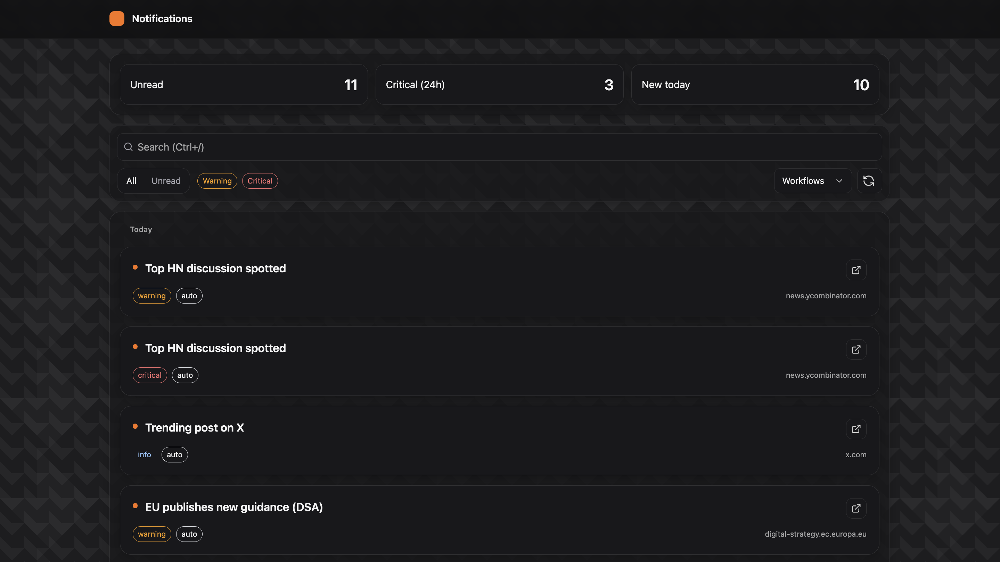

# Notification Center – FE/UX Assignment (Design-in-Code)

This repository contains a small Notification Center built with React + Tailwind. It is designed to demonstrate end‑to‑end thinking (product framing, UX, and implementation) within a 6–7 hour window. I intentionally “designed in code” to optimize for a working MVP and to keep the scope tight.

<p align="center">
  
</p>

## Why design in code?

- Time constraint: High‑fidelity mocks + multiple responsive states would easily exceed the allotted time. Designing in code let me express the UI, interactions, and constraints directly.
- Signal over polish: The goal is to show product decisions, architectural choices, and delivery speed. I prioritized the backbone (list → filters/URL → drawer → pagination) and made the UI cohesive and clear.
- Generalist approach: A deeply targeted, Kadoa‑specific design would require a few hours of product study and likely add code complexity. I intentionally kept a general Notification Center pattern, styled within the spirit of Kadoa’s visual language (dark theme, orange accent, subdued surfaces) without copying the site 1:1.

## Development process

I used AI to scaffold the backbone of the project. I started by prompting the desired elements, their placement and responsibilities (top KPIs, filters bound to the URL, grouped list, details drawer, and pagination). Once the structure was in place, I iterated with a mix of manual coding for styling and behavior and targeted AI assistance. Tools included Cursor (GPT‑5) and Claude Code (Opus 4.1). I leaned on AI to accelerate repetitive scaffolding and refactors, while hand‑crafting the interaction details, tokens, and data flow.

## What’s in this MVP

- Notification list grouped by time (Today / Yesterday / Earlier)
- Filters bound to URL (search, unread, severities, workflows) with debounced sync
- Pagination (server‑style) with compact controls and mobile adaptations
- Details drawer (summary, diff table, raw payload)
- Live updates via a mock subscription (new notifications arrive periodically)
- Theming and visuals tuned for a dark default, with refined light styles kept if needed
- Credible mock data (real outbound links for HN, Stripe pricing, EU DSA, React blog, X)

## What I explicitly chose not to do (and why)

- No deep, Kadoa‑specific workflows or tight domain coupling. That would require significant discovery and risks misrepresenting core product concepts in a short timebox.
- No Settings screen (theme switch, skin density) in the final cut. To reduce surface area and keep the demo focused, I defaulted to a single dark theme and removed settings UI and state.
- No real backend integration. The mock API is strongly typed, supports pagination and subscriptions, and can be swapped for a real client.

## Architecture overview

- React 19 (Vite 7), TypeScript strict, Tailwind 3
- URL and state
  - `zustand` stores: notifications (data + pagination) and filters (URL‑bound)
  - `src/url/query.ts` parses/builds query params; `NotificationsPage` preserves the `n` param (open drawer) to avoid flicker/close
- UI components
  - `NotificationList` → groups by day, renders `NotificationItem`
  - `DetailsDrawer` → overlay with summary/diff/raw
  - `Pagination` → compact 1–4 pages + Prev/Next; mobile full‑width; hides summary text on small screens
- Styling
  - Tailwind with custom tokens (accent, borders, neutrals), cohesive dark theme
  - Glassy surfaces with subtle rings and shadows, consistent orange ring for focus/selected states
- Data
  - `mockAdapter.ts` seeds 120 notifications with realistic titles and links; subscription simulates new items every ~20s

## Key UX decisions (within the timebox)

- Grouped timeline with clear section labels and extra spacing to reduce fatigue
- URL is the source of truth for filters and the open drawer; links are shareable
- Drawer actions wired (mark read/unread, pin/unpin) with immediate local feedback
- Pagination is intentionally simple (1–4) to keep controls compact while demonstrating server‑style paging

## Implementation highlights

- Preserving the drawer param `?n=<id>` when syncing filters to the URL fixes a common flicker/auto‑close bug.
- Pagination replaces the page rather than appending (no infinite growth when clicking Next).
- Live updates merge new items at the top and bump KPI counts (simple but effective signal).
- Credible outbound links:
  - Hacker News discussions (`/item?id=40,000,000+N`)
  - Stripe pricing page
  - EU Digital Services Act page (official site)
  - React blog
  - X explore

## What’s missing (if I had more time)

- A short “Approach” doc (Task 1) with personas, jobs‑to‑be‑done, MVP scope, risks, and success metrics
- A static design snapshot (Task 2) or annotated wireframes to show responsive states and empty/loading/error
- Bulk actions with the existing selection store (multi‑select + mark/pin)
- Sort and time‑range UI (params are already supported)
- A visible indicator for new items (“Jump to latest” chip/badge)
- Unit/component tests (URL parse/build, pagination clamping, drawer open/close)
- Saved views UI (the API supports it via localStorage)

## Getting started

```bash
npm i
npm run dev   # open http://localhost:5174/notifications
npm run test  # minimal tests (add more with time)
npm run build && npm run preview
```

## Repository tour

- `src/routes/NotificationsPage.tsx` – page orchestration (URL ↔ filters ↔ list ↔ drawer)
- `src/components/*` – modular UI: Drawer, List/Item, Pagination, Header
- `src/store/useNotifications.ts` – data + pagination state; actions: list, read/unread, pin/unpin, subscribe
- `src/store/useFilters.ts` – filter state that serializes to URL
- `src/api/mockAdapter.ts` – typed mock API with pagination + subscription and realistic links
- `src/styles/tailwind.css` – tokens, components, and utilities (dark theme defaults)

## Notable constraints & tradeoffs

- “Design in code” reduced handoff friction but limited the breadth of visual exploration
- Minimal dependencies to keep the footprint small and easy to reason about
- Dark theme is the default and only theme in the final cut to focus time on core flows

## Known edges

- No virtualization; with >1k items you’d want react‑virtuoso or equivalent
- Limited a11y audit; basic roles are in place, but I would extend testing with axe and Playwright if needed
- KPI “Critical (24h)” is a label; I would either compute 24h or rename in a real build

## Final note

This MVP is intentionally general and production‑lean. It demonstrates product framing through code, a pragmatic focus on the core UX (filters → list → details), and an approachable architecture I can extend with real data, saved views, and richer controls.
